<p align="center">
  
</p>

<p align="center">
  <a href="https://typescriptlang.org/"></a>
  <a href="https://nodejs.org/"></a>
  <a href="https://tree-sitter.github.io/tree-sitter/"></a>
  <a href="https://huggingface.co/Xenova/all-MiniLM-L6-v2"></a>
  <a href="LICENSE"></a>
</p>

<p align="center">
  <a href="#-how-it-works">How It Works</a> · <a href="#-quick-start">Quick Start</a> · <a href="#-architecture">Architecture</a> · <a href="#-security">Security</a> · <a href="#-tech-stack">Tech Stack</a>
</p>

---

## 📌 Overview

Probe is a CLI tool that lets you point at any codebase — local folder or GitHub link — and ask questions about it in plain English. It parses source code into AST-aware chunks that respect function and class boundaries, embeds them locally using `all-MiniLM-L6-v2` (no external API needed), stores the vectors on disk, and retrieves the most relevant chunks when you ask a question. Those chunks get piped to your choice of LLM, which streams back an answer citing exact file paths and line numbers.

The whole point: you shouldn't have to read an entire unfamiliar codebase just to figure out how auth works or where the database calls live. Index it, ask it, get pointed to the right files.

> Gemini is the default provider because it's free — no credit card, no billing setup. Just a Google sign-in.


---

## How It Works

```
probe index <path>        →   walks repo, parses code into chunks, embeds locally, stores vectors
probe ask "question"      →   embeds your question, finds similar chunks, streams an LLM answer
```

**Step by step:**

1. **Walk** — recursively scans the repo, filtering by file extension and exclusion patterns
2. **Chunk** — parses each file into logical pieces using Tree-sitter ASTs (Python, TypeScript, JavaScript, TSX, JSX) or regex fallback (Java, C, C++, C#, Go, Ruby, Rust, Markdown). Chunks follow function and class boundaries instead of splitting at arbitrary character counts
3. **Embed** — runs `Xenova/all-MiniLM-L6-v2` locally via HuggingFace Transformers.js to generate 384-dimensional vectors for each chunk. No API call, runs on CPU, model cached after first download (~80MB)
4. **Store** — vectors and metadata land in a local [Vectra](https://github.com/Stevenic/vectra) index inside `.probe/` in the repo. No database server, just JSON files
5. **Retrieve** — when you ask something, Probe embeds your question with the same model and finds the top-K most similar chunks via cosine similarity
6. **Answer** — the retrieved chunks are sent as context to your chosen LLM (Gemini, Claude, GPT-4o, Groq, or Mistral), which streams a response citing the files and line numbers it pulled from

---

## Quick Start

```bash
# clone and build
git clone https://github.com/riyonp23/Probe.git
cd Probe
npm install
npm run build
npm link

# pick a provider — Gemini is free, takes 30 seconds
probe setup

# index a repo (local path or GitHub link)
probe index ./my-project
probe index expressjs/express

# ask away — no --repo flag needed, remembers your last index
probe ask "how does authentication work?"
probe ask "where are the API routes defined?" --verbose
```

**Prerequisites:** Node.js 20+ and an API key from any [supported provider](#-supported-providers). Gemini is free.

---

## Architecture

```
┌──────────────────────────────────────────────────────────────┐
│                         probe index                          │
│                                                              │
│   File Walker ──→ Chunker ──→ Embedder ──→ Vectra Store      │
│                   ┌──────────┐  (local MiniLM,               │
│                   │Tree-sitter│   no API)                     │
│                   │  + regex  │                               │
│                   └──────────┘                                │
└──────────────────────────────────────────────────────────────┘

┌──────────────────────────────────────────────────────────────┐
│                         probe ask                            │
│                                                              │
│   Question ──→ Embed Query ──→ Cosine Search ──→ Top-K       │
│                                                  Chunks      │
│                                                    │         │
│                              Prompt Builder ◄──────┘         │
│                                    │                         │
│                           Provider Abstraction               │
│                    ┌───────┬───────┬───────┬───────┐         │
│                  Gemini  Claude  GPT-4o  Groq  Mistral       │
│                    └───────┴───────┴───────┴───────┘         │
│                                    │                         │
│                          Streamed Response                   │
│                      (with file + line citations)            │
└──────────────────────────────────────────────────────────────┘
```

### Key Engineering Decisions

**AST-Aware Chunking**
Most RAG tools split text by character count or paragraph breaks. Probe uses [Tree-sitter](https://tree-sitter.github.io/tree-sitter/) to parse actual abstract syntax trees, extracting individual functions, classes, and methods as discrete chunks. This means retrieved context is always a complete logical unit — not half a function.

**Local Embeddings**
Embeddings run entirely on your machine through `@huggingface/transformers` (ONNX runtime). No API key, no network call, works offline after the one-time model download. This also means indexing is free regardless of repo size.

**Provider Abstraction**
Only the selected provider's SDK gets loaded at runtime — the other four are never imported. ESM-only packages (Mistral) use a dynamic `import()` workaround to stay compatible with the CommonJS build. Provider errors (503s, 429s, timeouts) are retried automatically with exponential backoff (2s → 4s → 8s, 3 attempts max).

---

## 📖 Usage

### `probe index <path>`

Index a local directory or a GitHub repo. Supports local paths, full GitHub URLs, and `owner/repo` shorthands.

```bash
probe index ./my-repo
probe index expressjs/express
probe index https://github.com/pallets/flask
probe index ./my-repo --exclude "tests,docs" --languages ".py,.ts"
```

| Flag | Description |
|---|---|
| `-f, --force` | Overwrite existing index without asking |
| `--exclude <patterns>` | Comma-separated extra exclusion globs |
| `--languages <exts>` | Only index these file extensions |

### `probe ask <question>`

Ask a question about an indexed codebase. Defaults to whatever you last indexed — no `--repo` needed.

```bash
probe ask "how does auth work in this project?"
probe ask "walk me through the error handling" --verbose
probe ask "what does the chunker do?" --top-k 8
probe ask "how is routing done?" --repo expressjs/express
```

| Flag | Description |
|---|---|
| `--repo <path>` | Which repo to query (default: last indexed). Accepts GitHub URLs — auto-clones and indexes if not cached |
| `--top-k <n>` | Number of chunks to retrieve (default: 5) |
| `--max-tokens <n>` | Max response length (default: 4096) |
| `-v, --verbose` | Show retrieved chunks before the answer |

### `probe setup`

Interactive setup wizard. Pick a provider, paste your API key, and Probe encrypts it at rest.

```bash
probe setup              # interactive setup
probe setup --status     # show current config
probe setup --delete     # remove stored credentials
```

### `probe status [path]` · `probe specs`

```bash
probe status                    # stats for last indexed repo
probe status expressjs/express  # stats for a cached GitHub clone
probe specs                     # technical architecture overview
```

---

## Security

API keys are **encrypted at rest** using AES-256-GCM. The encryption key is derived from your machine's fingerprint (`hostname + username + homedir`) via `scrypt` with a per-install random salt, so the credentials file can't be decrypted on a different machine or user account. File permissions are set to `0600` (owner-only) on POSIX systems.

Other measures:
- **Prompt injection boundaries** — retrieved code chunks are wrapped in randomized delimiters (generated per-query via `crypto.randomBytes`) so malicious code can't escape the context frame
- **Input sanitization** — questions are stripped of control characters and capped at 2,000 characters
- **Key redaction** — error messages never expose the raw API key; all display goes through a redaction helper
- **GitHub cloning restricted to `github.com`** — no arbitrary URLs. Clone uses `child_process.spawn` (no shell), so repo names can't inject commands
- **Symlink protection** — the file walker skips symlinks to prevent escaping the repo directory
- **All provider API calls over HTTPS**

Full details in [SECURITY.md](SECURITY.md).

---

## 🔌 Supported Providers

Pick any of these during `probe setup`. Only the selected provider's SDK is loaded at runtime.

| Provider | Model | Free Tier | Get API Key |
|---|---|---|---|
| **Gemini** (default) | `gemini-2.5-flash` | ✅ No credit card | [aistudio.google.com/apikey](https://aistudio.google.com/apikey) |
| **Claude** | `claude-sonnet-4-20250514` | ❌ | [console.anthropic.com](https://console.anthropic.com/settings/keys) |
| **GPT-4o** | `gpt-4o` | ❌ | [platform.openai.com](https://platform.openai.com/api-keys) |
| **Groq** | `llama-3.3-70b-versatile` | ✅ | [console.groq.com](https://console.groq.com/keys) |
| **Mistral** | `mistral-large-latest` | ❌ | [console.mistral.ai](https://console.mistral.ai/api-keys) |

---

## Tech Stack

| Component | Technology |
|---|---|
| Language | TypeScript (strict mode) |
| CLI | Commander.js |
| Code Parsing | Tree-sitter (AST) + regex fallback |
| Embeddings | `all-MiniLM-L6-v2` via HuggingFace Transformers.js — runs locally, no API |
| Vector Store | Vectra — local JSON index, no server |
| LLM Providers | Gemini · Claude · GPT-4o · Groq · Mistral |
| Security | AES-256-GCM encryption, scrypt KDF, machine-bound key derivation |
| Terminal UI | Chalk + Ora |

---

## 📂 Project Structure

```
src/
├── index.ts                    CLI entry point (Commander.js setup)
├── commands/
│   ├── index-cmd.ts            "probe index" — walk, chunk, embed, store
│   ├── ask-cmd.ts              "probe ask" — retrieve, prompt, stream
│   ├── ask-helpers.ts          repo resolution + input sanitization
│   ├── setup-cmd.ts            "probe setup" — provider selection + key encryption
│   ├── status-cmd.ts           "probe status" — index stats
│   └── specs-cmd.ts            "probe specs" — architecture overview
├── pipeline/
│   ├── walker.ts               recursive file walker with exclusion/extension filters
│   ├── chunker.ts              AST-aware chunking dispatcher
│   ├── chunker-treesitter.ts   Tree-sitter backend (Python, TS, JS, TSX, JSX)
│   ├── chunker-regex.ts        regex fallback (Java, C, C++, C#, Go, Ruby, Rust)
│   ├── chunker-utils.ts        shared chunking helpers (Markdown, token estimation)
│   ├── embedder.ts             local embeddings via @huggingface/transformers
│   ├── store.ts                Vectra index management
│   ├── prompt-builder.ts       RAG prompt assembly with injection boundaries
│   ├── provider.ts             provider factory + auto-detection
│   └── providers/
│       ├── types.ts            Provider interface + retry logic
│       ├── gemini.ts           Google Gemini (default)
│       ├── anthropic.ts        Anthropic Claude
│       ├── openai.ts           OpenAI GPT-4o
│       ├── groq.ts             Groq
│       └── mistral.ts          Mistral AI
└── utils/
    ├── config.ts               credential resolution (env → .env → encrypted store)
    ├── security.ts             AES-256-GCM encryption + key redaction
    ├── github.ts               GitHub URL detection + shallow clone caching
    ├── github-url.ts           strict URL validation + path traversal protection
    ├── recent.ts               last-indexed-repo tracking
    ├── formatter.ts            terminal output (Chalk + Ora)
    ├── theme.ts                brand palette + CLI layout
    ├── prompts.ts              interactive readline helpers
    └── types.ts                shared interfaces + constants
```

---

## 🌐 Supported Languages

**Full AST parsing via Tree-sitter:**
Python · TypeScript · JavaScript · TSX · JSX

**Regex-based chunking:**
Java · C · C++ · C# · Go · Ruby · Rust · Markdown

---

## 📋 Requirements

- **Node.js 20+**
- **An API key** from any supported provider — Gemini is free and the default
- **C/C++ toolchain** (optional) — Tree-sitter needs it to compile native bindings (Xcode CLT on macOS, `build-essential` on Linux, MSVC Build Tools on Windows). If it fails, Probe falls back to regex chunking automatically

---

## License

[MIT](LICENSE)
